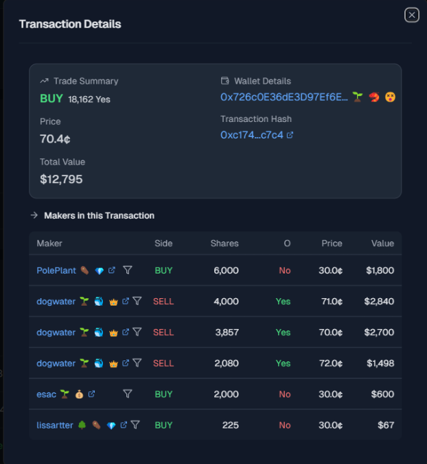

The picture above illustrates the Transaction Details interface in [this link](https://www.betmoar.fun/market/no-change-in-fed-interest-rates-after-june-2025-meeting?tab=Recent&filter=10000&filterType=CASH), that displays 2 main components the trade summary card and makers in this Tx table:

<b>The first card is the Trade Summary, which contains:</b>
1. Total BUY (Choosing yes decision).
2. Wallet Details: I have no idea what this is, seems to be a guy's wallet with the highest volume of $12,795 Total Value.
3. Price: The price at the execution .
4. Tx Hash: The transaction hash.
5. Total Value: The total value of $12,795.

<b>The second table is the Maker in this Tx table, which contains:</b>
1. Maker: The maker's name with some icons depicting the role, PNL, and volume.
2. Side: The maker decision side (buy or sell).
3. Shares: The number of shares in the trade.
4. O: Seems it is stand for Option that corresponds to the Side.
5. Price: The price at the execution time.
6. Value: The total value of the trade = Shares * Price.

<b>Data sources</b>
1. Blockchain: Polygon - Retrieves wallet details, tx hash, and on-chain trade execution data.
2. Market Price API: Retrieves latest price per share and calculate total trade value.
3. Internal Database/Cache: Store historical trade data and provide real-time order book updates.

<b>Data flow process</b>
1. User places a Market Order (Taker)
    - Taker submits a buy or sell order at the current market price.
    - System finds the best matching maker(s) orders (Market Order).
2. Matching Engine Executes Trades
    - Aggregates all makers orders until the taker order is fully filled.
    - Use price-time priority (First in First served).
3. Settlement
    - Order is recorded on-chain.
4. UI Updates
    - Display execution details for taker and market orders, update order book and market price in real-time.

<b>Some insights and optimizations ideas:</b>
1. Large orders may sweep the order book and cause slippage.
2. Adding some technical indicators to the UI to help users make better decisions.
3. Implement copy trading feature to follow successful traders.
4. Adding related news and events to the market page.

